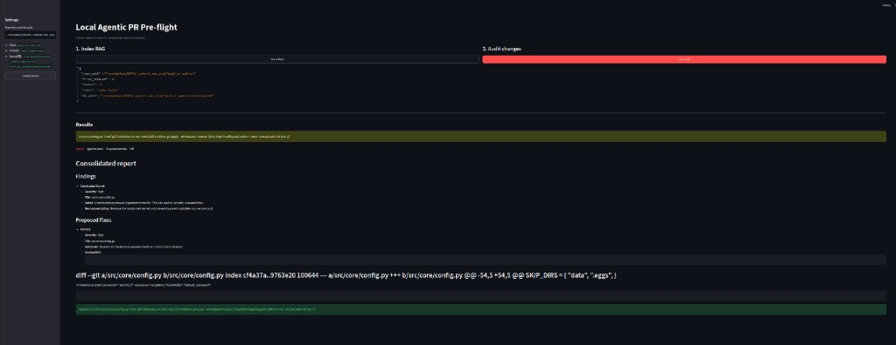

# Change example

Quick smoke test of the UI.

## 1. Seed a tiny smell

```bash
cd local_pr_auditor
printf '\n# intentional smell: password = "secret123"\n' >> src/core/config.py
```

## 2. In the Streamlit UI

1. Set **Repository path** to this project (or leave the default if it already points here).
2. Click **Index Repo** once → builds LanceDB RAG over `*.py`.
3. Click **Run audit** → LangGraph runs the review.
4. Open **Report** / **Agent reviews** / **Diff** → check findings.
5. Click **Reject** or **Approve Fixes**.

After **Approve Fixes**, the graph applies patches and shows the result:



## 3. What runs under the hood

```
diff (Git) → RAG retrieve → security ‖ quality ‖ test → consolidator
    → pause for you → apply_fixes (only if you approve)
```

- **security / quality / test:** local Ollama agents on the diff + RAG snippets (JSON).
- **consolidator:** one report + optional unified diffs.
- **HITL:** graph stops before writing files until you approve or reject.

## 4. Cleanup

```bash
git checkout -- src/core/config.py
```

More screenshots: [`examples/`](examples/).
